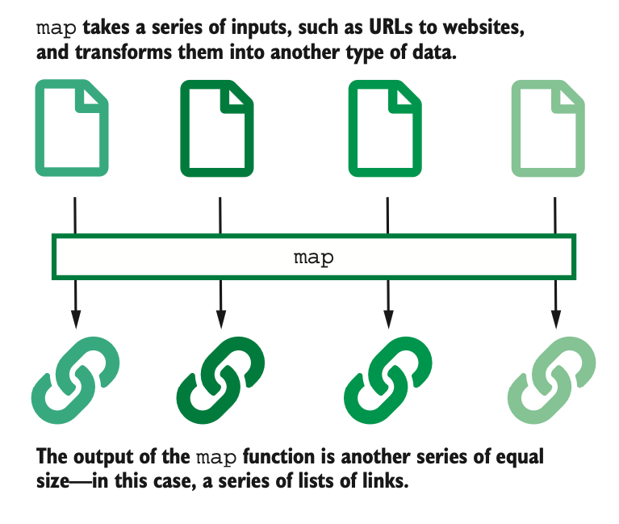
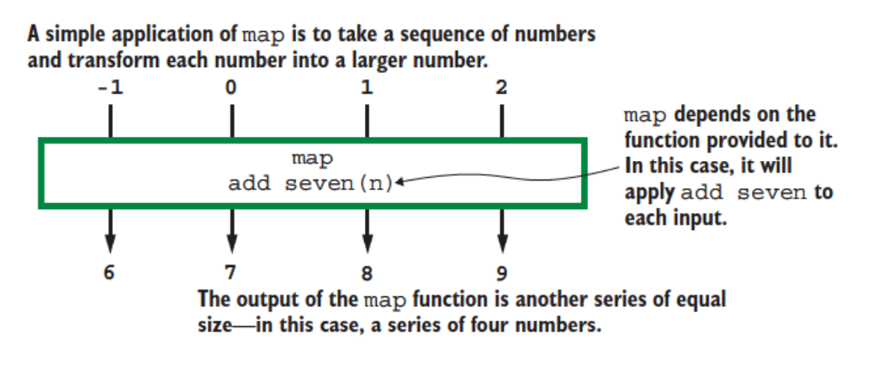
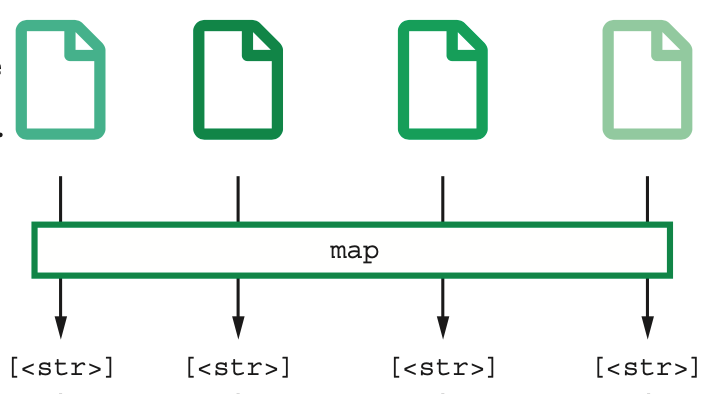
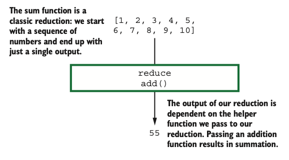
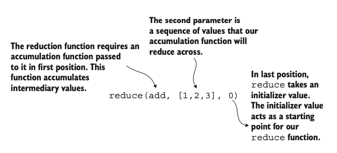
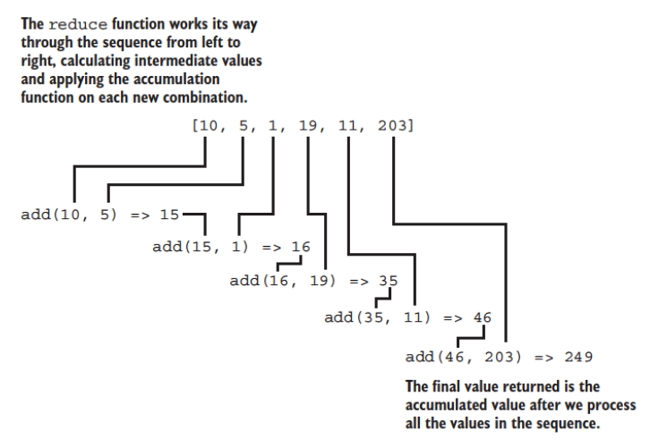
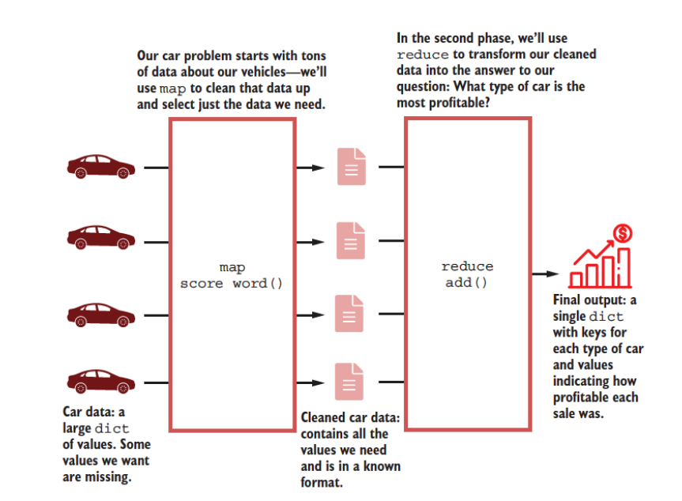
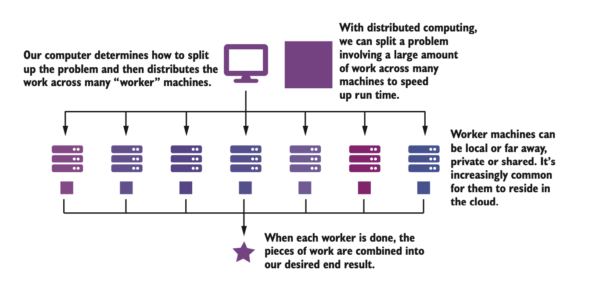

# Functional Programming {.section}

## Map and Reduce

## {background-image="img/parallel-time.png" background-size="contain"}

## Components of a parallel programming workflow

1. Divide the work into chunks
1. Work on each chunk separately
1. Reassemble the work

This paradigm is often referred to as a **map-reduce framework**, or, more
descriptively,  the **split-apply-combine** paradigm

## {background-image="img/split-apply-combine.png" background-size="contain"}

## {background-image="img/split-apply-combine-2.png" background-size="contain"}

# Map {.section}

## Map

The **map** operation is a 1-1 operation that takes each split and processes it

The **map** operation keeps the same number of objects in its output that were present in its input

::: {style="text-align: center; width: 50%; height: 50%"}

:::

## Map

::: {style="text-align: center; width: 80%, height: 80%"}

:::

The operations included in a particular **map** can be quite complex, involving multiple steps. In fact, you can implement a _pipeline_ of procedures within the **map** step to process each data object.

The main point is that the _same_ operations will be run on each data object in the **map** implementation

## Map

Some examples of a **map** operations are

1. Extracting a standard table from online reports from multiple years
1. Extracting particular records from multiple JSON objects
1. Transforming data (as opposed to summarizing it)
1. Run a normalization script on each transcript in a GWAS dataset
1. Standardizing demographic data for each of the last 20 years against the 2000 US population

::: {.imgcenter .imghalf}

:::

# Reduce {.section}

## Reduce

The **reduce** operation takes multiple objects and _reduces_ them to a (perhaps) smaller number of objects using transformations that aren't amenable to the **map** paradigm.

These transformations are often serial/linear in nature

The **reduce** transformation is usually the last, not-so-elegant transformation needed after most of the other transformations have been efficiently handled in a parallel fashion by **map**

::: {.imgcenter .imghalf}

:::

## Reduce

The **reduce** operation requires

<ol type='a'>
<li> An <i>accumulator</i> function, that will update serially as new data is fed into it
<li> A sequence of objects to run through the accumulator function
<li> A starting value from which the accumulator function starts
</ol>

Programmatically, this can be written as

::: {.imgcenter style="width: 80%; height:80%;"}

:::

## Reduce

The **reduce** operation works serially from "left" to "right", passing each object successively through the accumulator function.

For example, if we were to add successive numbers with a function called `add`...

::: {.imgcenter style="width: 80%; height: 80%;"}

:::

## Reduce

Some examples:

1. Finding the common elements (_intersection_) of a large number of sets
1. Computing a table of group-wise summaries
1. Filtering
1. Tabulating

# Map & Reduce {.section}

## map-reduce

Combining the **map** and **reduce** operations creates a powerful pipeline that can handle a diverse range of problems in the Big Data context

::: {.imgcenter .imghalf}

:::

# Parallelization and map-reduce {.section}

## Parallelization and map-reduce are bed-mates

::: {.imgcenter style="width: 80%; height: 80%;"}

:::

::: {.fragment}

One of the issues here is, how to split the data in a "good" manner so that the map-reduce framework works well

:::
