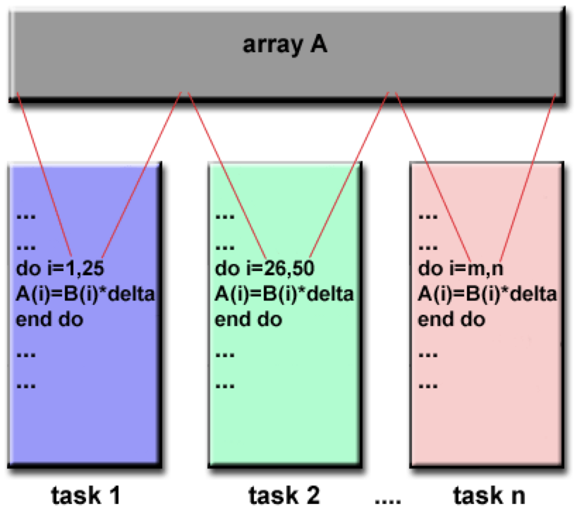
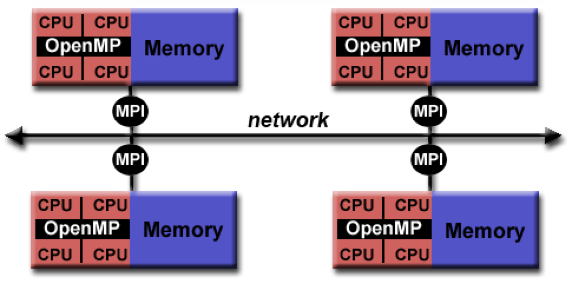
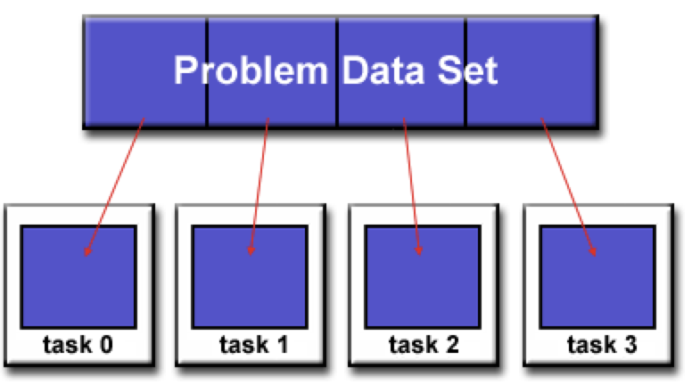

# Parallel Programming Models {.section}

## Distributed memory / Message Passing Model

::: {style="text-align: center;"}

:::

## Data parallel model

::: {style="text-align: center;"}

:::

## Hybrid model

::: {style="text-align: center;"}

:::
::: {style="text-align: center;"}

:::

## Partitioning data

::: {style="text-align: center;"}

:::

## Designing parallel programs

+ Data partitioning
+ Communication
+ Synchronization / Orchestration
+ Data dependencies
+ Load balancing
+ Input and Output (I/O)
+ Debugging

::: {.fragment}

A lot of these components are data engineering and DevOps issues
:::
::: {.fragment}

Infrastructures have standardized many of these and have helped data scientists implement parallel programming much more easily
:::
::: {.fragment}

We'll see in the lab how the `multiprocessing` module in Python makes parallel processing on a machine quite easy to implement
:::
